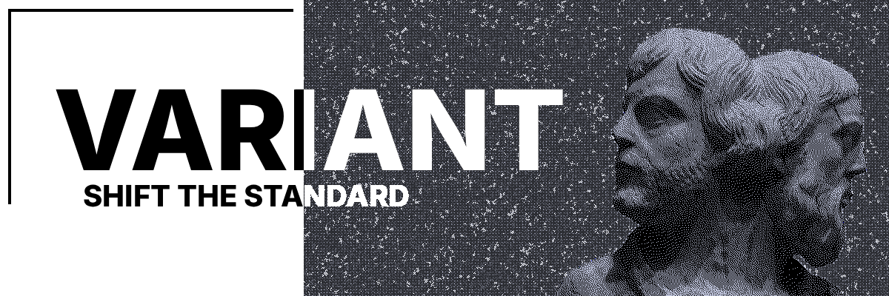

<p align="center">
  
</p>

<br/>
<br/>
<br/>

## About
External game utility for Counter-Strike 2. Hooks into the D3D11 rendering pipeline to provide an interactive ImGui overlay and a complete input system built to work around Source 2's SDL3 layer.

<br/>

Written in C++23 with a modular architecture where each feature lives in its own isolated module. The core framework handles rendering, input capture, cursor control, and game interface discovery - providing a clean foundation to build gameplay features on top of.

<br/>
<br/>

## Features

- D3D11 Present + ResizeBuffers hooks via MinHook
- ImGui overlay with full mouse/keyboard interaction
- Dual-layer cursor control (InputSystem vtable + SDL3 hook)
- Low-level input hooks (WH_KEYBOARD_LL + WH_MOUSE_LL) to bypass SDL3 input stealing

<br/>
<br/>

## Building

Requires:
- MSVC (Visual Studio 2022+)
- CMake 3.25+
- Ninja (recommended)

<br/>

```
cd variant
cmake -B build/Debug -G Ninja -DCMAKE_BUILD_TYPE=Debug
cmake --build build/Debug
```

<br/>

Output: `build/Debug/variant.dll`

<br/>
<br/>

## Usage

1. Launch CS2 with `-insecure` in Steam launch options
2. Inject `variant.dll` into `cs2.exe` (after game loads)
3. Press **INSERT** to toggle the menu
4. Press **END** to unload

<br/>
<br/>

## Structure

```
src/
├── main.cpp              DllMain, initialization thread
├── core/
│   ├── interfaces.*      D3D11 vtable discovery, game interfaces
│   ├── hooks.*           Present, ResizeBuffers, WndProc hooks
│   └── menu.*            ImGui menu rendering
└── utilities/
    ├── debug.*           Console logging
    ├── memory.*          Pattern scanning, vtable access
    ├── hookmanager.h     MinHook wrapper
    └── inputhook.*       Low-level keyboard + mouse hooks
```

<br/>
<br/>

## Dependencies

- [Dear ImGui](https://github.com/ocornut/imgui) - immediate-mode GUI (D3D11 + Win32 backends)
- [MinHook](https://github.com/TsudaKageworther/minhook) - x64/x86 hooking library

## License

[MIT](LICENSE)
